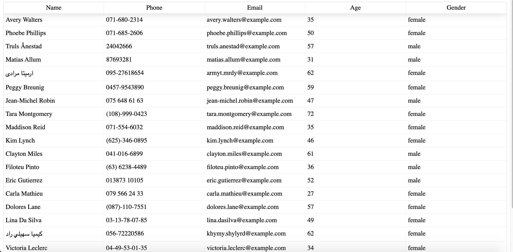

# Online-offline-budget-tracker

App deployed at: http://DevinCastro.github.io/employee-directory

### Description:
>This application renders data from a 3rd party api, and displays it on page load.  There are 20 employees with 5 columns that show the employees: name, age, gender, email, and phone number!  

## Technologies Used:
This is a React application made with create-react-app.  Used react-table-v6 to render the employee data into a nice table.  

## Usage:
The employee data will render on page load.  You can sort the data by simply clicking the header of the column that you want the data sorted by.  For exmaple, clicking "name" will sort the employees by name. 

